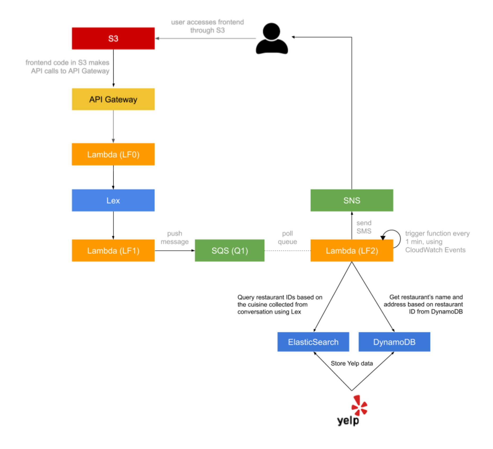

# nyu-cloud-computing-spring-22-a1-chatbot
A chatbot that sends restaurant recommendations based on user preference.

### Problem Statement
Problem statement is in file _problem_statement.odt_.

### Application Architecture

### Code Directory Structure
1. _aws_frontend_: contains all frontend related files. All files in this directory can be put into an AWS S3 bucket as it is.
2. _aws_lambda_: Contains all the AWS Lambda functions involved in this project. Each file represents a different lambda function.
3. _utils_: Contains other utility scipts for parsing data and pushing it to various services of AWS (DynamoDB, OpenSearch).

